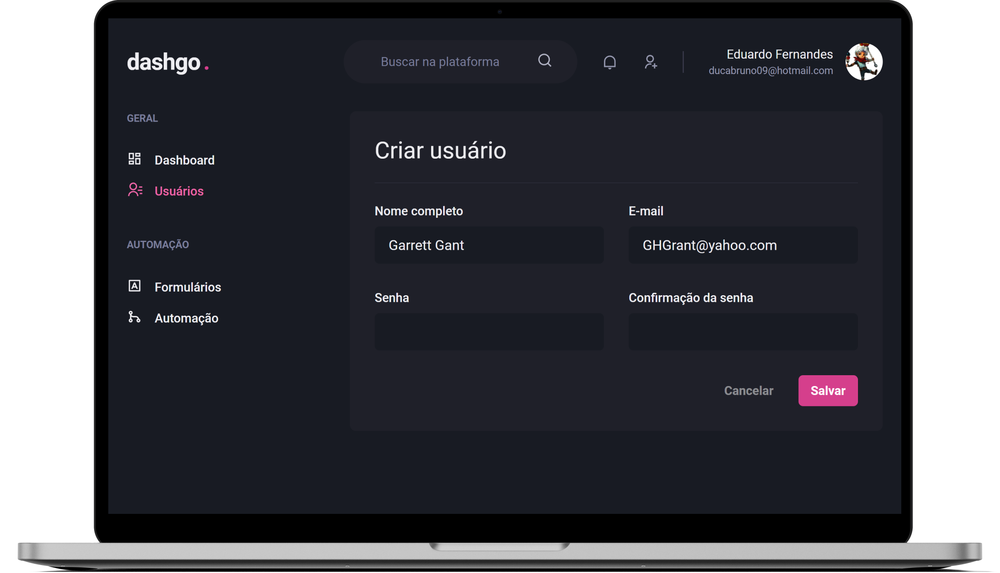

<h1 align="center">
  </img>
</h1>

<p align="center">
  <a href="#ℹ-descrição">Descrição</a> •
  <a href="#-tecnologias">Tecnologias</a> •
  <a href="#-pré-requisitos">Pré-requisitos</a> •
  <a href="#-como-usar">Como usar</a> •
  <a href="#-espiadinha">Espiadinha</a>
</p>

<p align="center">
  </img>
</p>

## ℹ Descrição

Projeto desenvolvido ao longo do capítulo 4 do Ignite. 👨‍🚀🚀

Dashgo é uma dashboard para monitoramento dos seus usuários e inscritos. O projeto, além de ser todo feito com _Chakra UI_ e sua responsividade, possui funcionalidades como:

- Na página de Login:
  - Fazer login através de um formulário com _React Hook Form_ e validações com _Yup_, sendo direcionado para página Dashboard;
- Na página Dashboard:
  - Visualização de dados através de gráficos com _ApexCharts_;
  - Navegação para página Users por meio do Drawer do _Chakra UI_;
- Na página Users:
  - Dados fakes de usuários com _Faker_ (versão 5.5.3) e API mock com _Mirage_;
  - Fetch e cache de dados com _React Query_ e listagem de todos os usuários (10 por página);
  - Prefetch de dados de tal usuário ao passar o mouse por cima;
  - Componente Pagination para permitir a navegação entre páginas de usuários;
  - ~~Editar os dados de um determinado usuário;~~
  - Na página Users/create:
    - Criação de um novo usuário com _React Hook Form_ + _Yup_, com efeitos colaterais para o servidor com useMutation do _React Query_;
- Entre outros…

## ⚒ Tecnologias

- [**React**](https://pt-br.reactjs.org)
- [**Typescript**](https://www.typescriptlang.org)
- [**Next.js**](https://nextjs.org/)
- [**Chakra UI**](https://chakra-ui.com/)
- [**React Icons**](https://react-icons.github.io/react-icons/)
- [**React Hook Form**](https://react-hook-form.com/)
- [**Yup**](https://github.com/jquense/yup)
- [**React Query**](https://react-query.tanstack.com/)
- [**ApexCharts**](https://apexcharts.com/)
- [**Axios**](https://axios-http.com/)
- [**Miragejs**](https://miragejs.com/)
- [**Faker v5.5.3**](https://www.npmjs.com/package/faker/v/5.5.3)

## ⚙ Pré-requisitos

- <a href="https://git-scm.com/" target="_blank">Git</a>
- <a href="https://yarnpkg.com/" target="_blank">Yarn</a>
- Editor de código.

## 🖥 Como usar

**Clone o projeto e acesse a pasta**

```bash
$ git clone https://github.com/EduardoReisUX/dashgo.git && cd dashgo
```

**Siga os passos seguintes**

```bash
# Instale as dependências
$ yarn

# Rode a aplicação
$ yarn dev
```

## 👀 Espiadinha

<p align="center">
</img>
</p>

---

<p align="center">Feito com 💜 por <a href="https://github.com/EduardoReisUX">Eduardo dos Reis</a></p>
<p align="center">Deployed by ▲ Vercel</p>
